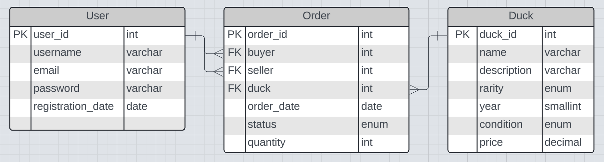

# Dux_Group_2

## ERD

## User Stories (MVP)
### As a user:
- [ ] I want to login
    - so that I have access to my ducks and profile page, as well as the marketplace
- [ ] I want to be able to register an account
    - so that I can save my information for the future
- [ ] I should be able to create and maintain a profile page.
    - so that I could view, use, update, or delete my information
- [ ] I should be able to see a list of available products
  - so that I could add them to my cart
- [ ] I should be able to add items to my cart
  - so that I could later purchase or remove from my cart
- [ ] I should be able to checkout with the items in my cart
  - so that I can purchase products and remove them from cart

## Non-MVP
### As a user:
- [ ] I should be able to select an amount of an item to add to my cart as I am adding an item
    - so that I can purchase multiple of the same item
- [ ] I should be able to search the product list to better find the item(s) I am interested in
    - so that I can have an easier time searching
- [ ] I should be able to see and purchase items that are on sale for a lower price.
- [ ] I should be able to see a list of featured products on the main page of the application
- [ ] I should be able to reset my password.
    - so that if I forgot it I can still access my account
- [ ] I should be able to change the color scheme from the normal mode to a dark mode option.
- [ ] I should be able to enter a live chat with technical support.
    - so that I can ask questions

### As an "Employee"
- [ ] I should be able to accept a live chat request
    - so that I can answer any questions a customer may have